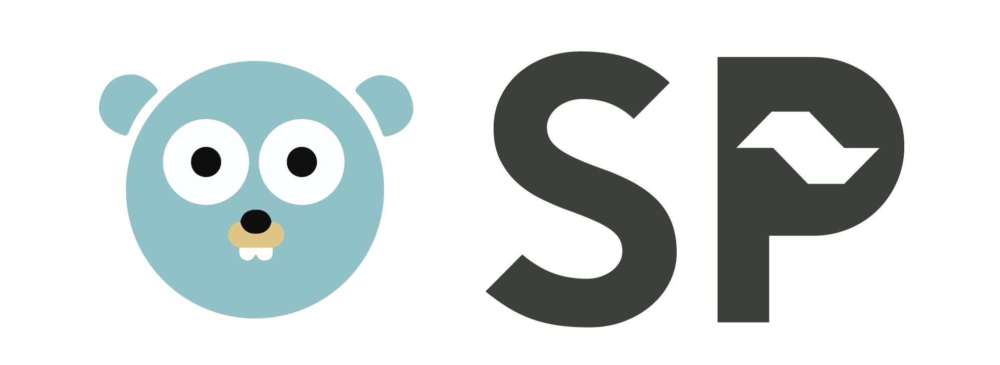

<p align="center">
  <a href="" rel="noopener">
    
  </a>
</p>

<h2 align="center"> Gopher Lite Mailer </h2>

---

<p align="center"> 
    <br> 
</p>

## 📝 Table of Contents

- [WHY](#why)
- [Instalation](#instalation)
- [Usage](#usage)
- [Getting Gmail App Password](#password)

## 📕 WHY <a name = "why"></a>

This program is designed to help the GolangSP meetup organization to efficiently send emails to participants regarding meetup confirmations, coupons, takeaways, news, and more. 

This CLI tool allows you to customize email templates, include CSS styling, add signature images, customize e-mail headers, and include attachments.

## 🚀 Instalation <a name = "instalation"></a>

Clone the repository and build the application:

```go
git clone https://github.com/reneepc/gopher-lite-mailer.git
cd gopher-lite-mailer
go build -o gopher-lite-mailer
```

## 🎈 Usage <a name="usage"></a>

The basic usage of the application is as follows:

```go
./gopher-lite-mailer [options] <email> <password>
```

| The email and password are the credentials that are going to be used to send the emails.

By default it is going to use the `templates` directory as its source for email templates. This can be changed by using the `-dir` flag.

The templates are composed basically of two files: `template.html` and `data.csv`. The first is a Go `template/html` file that is going to be used to generate the email body. The second is a CSV file that contains the data that is going to be used to fill the template. The file names can be changed using the flags: `-template` and `-data`.

The values extracted from the CSV file must have the `{{.Data.Field}}` structure. The `{{.Data}}` is necessary to avoid conflicts with the safe templates of CSS and signature.

The CSV file should have the following structure:

```csv
Email,Field1,Field2,Field3,...
email@example.com,Value1,Value2,Value3,...
...
```

| The presence of the headers is obligatory.

### Subject

You can specify the email subject using the `-subject` flag. By default, it will use an empty string.

### CSS

It's possible to customize the style of the email using the tag `<style>{{.Css}}</style>` in the html email template. By default, it will read the file `styles.css` in the `assets` directory. This can be changed using the `-css` flag.

### Signature

It's also possible to include a signature image in the email footer. By default, it will get the [Golang SP Logo](https://golang.sampa.br/img/golangsp01.png) from the internet. This can be changed using the `-signature` flag, passing a link to a new image.

### Attachments

## 📧 Getting Gmail App Password <a name="password"></a>

To send emails using the Gmail SMTP server, it is necessary to generate an app password. To do so, follow the steps below:

1. Logged on your Google account, go to the [App Passwords](https://myaccount.google.com/apppasswords) page.
2. You will be prompted to log in again.
3. Just fill the name of the app (e.g. Gopher Lite Mailer) and click on the "Create" button.
4. A password will be generated. COPY IT! You won't be able to see it again.
